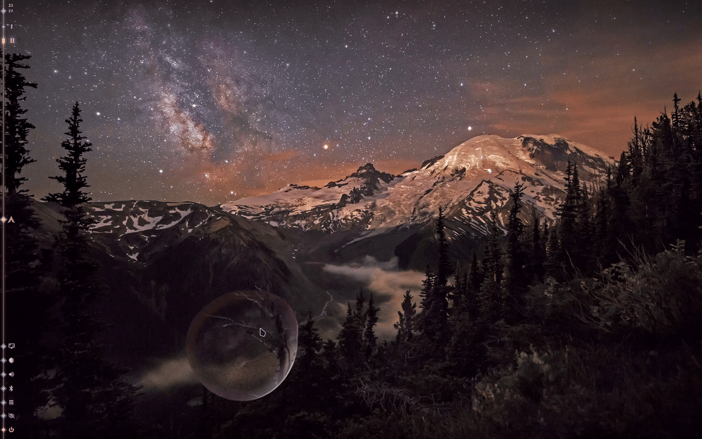

# Glasscope

A liquid-glass magnifier and colour picker for Hyprland. Follow the pointer,
inspect small details, and copy a pixel's RGB value without changing the
application underneath.



## Features

- A magnifying lens with refraction, colour dispersion and a convex centre.
- A soft trailing shape while moving, followed by a short liquid bounce when
  the pointer stops.
- Pin the live lens in place, tap it for a small tremble, or pull its surface
  with an anchored elastic rebound.
- Smooth filtering for reading and nearest-neighbour sampling for pixel work.
- Click-to-pick colour sampling with an adaptive crosshair, live swatch and
  `rgb(R, G, B)` clipboard output.
- Four configurable colour layers: transmission, inner refraction, outer
  reflection and highlight. Colour strength and band width are independent.
- Pointer input passes through in follow mode. A pinned lens consumes left
  clicks inside its shape and their matching releases, including after a drag
  leaves the shape. Colour-pick confirmation also consumes its press and release.
- Lua functions and Hyprland dispatchers for custom bindings.

## Requirements

Developed and tested with **Hyprland 0.56.2 and its Lua configuration**.

- Hyprland development headers matching the running compositor.
- CMake 3.25 or newer, a C++23 compiler, pkg-config, GLESv2 and Lua development
  files.
- Hyprland's OpenGL renderer and an unrotated output.
- `wl-copy` from `wl-clipboard` for copying sampled colours.

Hyprland plugins are tied to the compositor version they were built against.
Rebuild Glasscope after a Hyprland upgrade. Glasscope stays inactive on the
lock screen.

## Installation

### Build and load directly

```bash
git clone https://github.com/Horizon0427/glasscope.git
cd glasscope
cmake -S . -B build -DCMAKE_BUILD_TYPE=Release
cmake --build build --parallel 4
install -Dm755 build/glasscope.so \
  "$HOME/.local/lib/hyprland-plugins/glasscope/glasscope.so"
```

Add this loader to your Hyprland Lua configuration, before the Glasscope
configuration below:

```lua
if os.getenv("HYPR_NO_PLUGINS") ~= "1" then
    hl.plugin.load(
        os.getenv("HOME") .. "/.local/lib/hyprland-plugins/glasscope/glasscope.so"
    )
end
```

### Install with HyprPM

If your system provides `hyprpm`, you can use it to build and load the plugin:

```bash
hyprpm update
hyprpm add https://github.com/Horizon0427/glasscope
hyprpm enable glasscope
hyprpm reload -n
```

Use one loading method. The direct-loading Lua block is not needed when HyprPM
manages Glasscope. For HyprPM startup loading, add:

```lua
hl.on("hyprland.start", function()
    if os.getenv("HYPR_NO_PLUGINS") ~= "1" then
        hl.exec_cmd("hyprpm reload -n")
    end
end)
```

## Configuration and quick start

Add this block after the plugin loader. It enables a compact `130` px lens with
subtle lime and rose accents, and adds the example shortcuts listed below.


```lua
if os.getenv("HYPR_NO_PLUGINS") ~= "1" and hl.plugin.glasscope ~= nil then
    hl.config({
        plugin = {
            glasscope = {
                enabled = true,

                radius = 130,
                edge_width = 22.0,
                zoom = 2.0,
                bulge = 0.08,
                refraction = 1.0,
                dispersion = 0.7,
                edge_strength = 1.25,
                motion_strength = 1.5,
                interaction_bounce = 1.0,
                nearest = false,

                color_strength = 0.3,
                color_width = 18.0,
                colors = {
                    transmission = "rgba(ffb8740d)",
                    refraction = "rgba(afd428a6)",
                    reflection = "rgba(f77a9599)",
                    highlight = "rgba(efe0d580)",
                },
            },
        },
    })

    hl.bind("SUPER + SHIFT + A", function()
        hl.plugin.glasscope.toggle()
    end, { description = "Toggle Glasscope liquid lens" })

    hl.bind("SUPER + ALT + C", function()
        hl.plugin.glasscope.begin_color_probe()
    end, { description = "Start Glasscope colour picker" })

    hl.bind("SUPER + ALT + A", function()
        hl.plugin.glasscope.toggle_pin()
    end, { description = "Pin or unpin Glasscope lens" })

    hl.bind("SUPER + ALT + Escape", function()
        hl.plugin.glasscope.cancel_color_probe()
    end, { description = "Cancel Glasscope colour picker" })
end
```

Apply the configuration and check the plugin:

```bash
hyprctl reload config-only
hyprctl plugin list
hyprctl configerrors
```

## Picking a colour

1. Press your keybinds once.
2. Move the crosshair to the pixel you want. The swatch inside the lens follows
   the centre pixel's colour.
3. Left-click to confirm. Glasscope consumes that press and its matching release,
   restores normal cursor visibility, and copies text such as `rgb(175, 212, 40)`.
4. Paste the result into your editor or colour field. A short notification and
   swatch provide feedback. If the lens was hidden before picking, it hides
   again after that feedback fades.


The result currently uses `rgb(R, G, B)` text. `wl-clipboard` must be installed
for clipboard output.

## Pinning and dragging

With the example bindings, press `Super+Alt+A` to pin the lens at its current
position. If it is hidden, this opens a pinned lens at the pointer. The picture
remains live while the pointer can move independently.

Press inside the pinned shape for a small, steady compression; release a click
for one liquid bounce. Hold and pull to deform the whole lens: it lengthens
as two joined drops. The first press chooses the pulled share from its depth
inside the resting lens: about 6% near the rim, increasing smoothly to 50% at
the centre. This controls the relative weights of two implicit field sources. Moving
the pointer during that drag does not change the allocation. Re-grabbing during
a rebound blends toward the new allocation to avoid an abrupt size change.

The body source remains at the pin. The sources blend through an inverse-square
metaball field, so the neck curves continuously into both lobes without an
inserted straight bridge. Separation approaches the field's pinch-off distance
with a safety margin. The complete silhouette is numerically normalized to the
resting projected area. This is a visual surface model, not a fluid simulation.
The field construction follows [Jamie Wong's explanation of metaballs](https://jamie-wong.com/2014/08/19/metaballs-and-marching-squares/);
the damped return uses the spring-and-damper principle described in
[Gaffer on Games](https://gafferongames.com/post/spring_physics/).
The pin and sampling position stay fixed. The pull limit remains 1.8 times the
radius with increasing resistance; release damping follows the stored pull
strength, and the returning surface briefly compresses as the drops merge.
Releasing a pull lets that deformation spring back, without adding a separate
click bounce. Recent drag velocity carries into release; pausing first lets
that momentum decay. Near the merge, a smooth transition connects the liquid
lobes to an area-preserving squash. Clicks release from their existing pressure
state into a damped spring, including when a rebound is grabbed again.
Settled clicks choose a new deformation direction and vary the impulse by up to
8%; re-grabbing an active bounce preserves its direction. At the first merge,
drag recoil excites a short surface shiver with the following lens's faster
rhythm. The main squash is slightly gentler, leaving the smaller ripples visible.
The ordinary following animation itself is unchanged.
These transitions follow the continuous position-and-velocity approach in
[The Orange Duck's spring animation guide](https://theorangeduck.com/page/spring-roll-call).

`interaction_bounce` controls the pinned click and recoil squash amplitude:
`1.0` is the default, `1.5` is stronger, and `0` disables this added surface
bounce. It does not change held pull reach, the return timing, or the ordinary
pointer-stop bounce. `motion_strength` remains the master deformation control.
Small pointer jitter does not stretch the lens. Transparent
corners pass clicks through.

Press `Super+Alt+A` again to resume following. `Super+Shift+A` still hides or
shows the lens, preserving its pinned position. Disabling or unloading the
plugin resets the pin. Starting a colour probe temporarily follows the pointer;
cancelling or completing it restores the pinned position after the feedback.

Other mouse buttons and scrolling retain their normal behaviour. Only begin a
pull from inside the pinned lens; a drag started in the application stays with
that application.

## Configuring lens colours

### Strength and width

The two main controls are independent of the optical geometry:

- `color_strength`: `0.0` keeps the original liquid-glass appearance, including
  its built-in mint/lilac rim and specular highlight. Increase it toward `1.0`
  to add more of the configured colours. The example uses `0.3`.
- `color_width`: width of the custom colour band in logical pixels. Start with
  `18.0`; use `12.0` for a thinner band or `22.0` for a wider one.

The built-in default for `color_strength` is `0.0`, so setting colour values
alone does not enable custom colouring. Set it above zero to see your palette.

### Four colour layers

| Option | Role | Explicit example |
| --- | --- | --- |
| `colors.transmission` | Gentle colour-channel absorption in the transmitted image. | `rgba(ffb8740d)` — warm amber, about 5% alpha. |
| `colors.refraction` | Colour on the inner part of the custom band. | `rgba(afd428a6)` — lime, about 65% alpha. |
| `colors.reflection` | Colour near its outer edge, weighted toward the light-facing side. | `rgba(f77a9599)` — rose, 60% alpha. |
| `colors.highlight` | Tint blended into the original specular highlight, retaining its shape and intensity coefficient. | `rgba(efe0d580)` — warm off-white, about 50% alpha. |

### All options

Dimensions are logical pixels and follow the monitor scale.

| Option | Type | Built-in default | Range |
| --- | --- | --- | --- |
| `enabled` | bool | `false` | `true` / `false` |
| `radius` | int | `190` | `80..600` |
| `edge_width` | float | `22.0` | `4..48` |
| `zoom` | float | `2.0` | `1..6` |
| `bulge` | float | `0.08` | `0..0.28` |
| `refraction` | float | `1.0` | `0..2` |
| `dispersion` | float | `0.7` | `0..2` |
| `edge_strength` | float | `1.25` | `0..2.5` |
| `motion_strength` | float | `1.5` | `0..2.5` |
| `interaction_bounce` | float | `1.0` | `0..2.5` |
| `nearest` | bool | `false` | `true` / `false` |
| `color_strength` | float | `0.0` | `0..1` |
| `color_width` | float | `18.0` | `4..48` |
| `colors.transmission` | colour | `rgba(00000000)` | Hyprland colour |
| `colors.refraction` | colour | `rgba(00000000)` | Hyprland colour |
| `colors.reflection` | colour | `rgba(00000000)` | Hyprland colour |
| `colors.highlight` | colour | `rgba(00000000)` | Hyprland colour |

Glasscope clamps finite numeric settings to the ranges above before using them.
Non-finite settings (NaN or infinity) fall back to that option's built-in default.
This applies to direct configuration writes as well as temporary adjustment
overrides. Hyprland's `getoption` can still report the raw configured value;
Glasscope normalizes its effective snapshot without rewriting the configuration.
The `adjust_*` Lua functions reject non-finite deltas without changing the value.

`bulge` controls additional convex magnification near the centre. `refraction`
controls edge displacement and optical tint; `dispersion` controls RGB
separation at the rim. `edge_strength` scales the rim effects, including shade
and highlight. `motion_strength = 0` keeps a circular shape. Enable `nearest`
for pixel inspection; leave it off for smoother reading.

## Lua API

Functions are available under `hl.plugin.glasscope` after the plugin loads.

| Function | Action |
| --- | --- |
| `toggle()` | Show or hide the lens at the pointer. |
| `show()` | Show the lens. |
| `hide()` | Hide the lens and cancel an active probe. |
| `toggle_pin()` | Pin the lens, or resume following the pointer; shows a hidden lens. |
| `is_pinned()` | Return whether the lens is currently pinned. |
| `begin_color_probe()` | Enter interactive picking until a left click or cancellation. |
| `pick_color()` | Request a centre-pixel sample and clipboard copy; also works as a one-shot action. |
| `cancel_color_probe()` | Leave probe mode without sampling. |
| `adjust_zoom(delta)` | Change the current zoom. |
| `adjust_radius(delta)` | Change the current radius. |
| `adjust_edge_width(delta)` | Change the current optical edge width. |

The three adjustments are temporary overrides and reset on the next
configuration reload. For example:

```lua
hl.bind("SUPER + ALT + mouse_up", function()
    hl.plugin.glasscope.adjust_zoom(0.2)
end)
```

The corresponding dispatcher names are `glasscope:toggle`, `glasscope:show`,
`glasscope:hide`, `glasscope:toggle-pin`, `glasscope:begin-color-probe`, `glasscope:pick-color` and
`glasscope:cancel-color-probe`. In Lua configuration, use the functions above.

### Hidden, disabled and unloaded

`hide()` hides the lens. Setting `enabled = false` stops the runtime and releases
its GPU resources, while keeping the plugin API registered. After re-enabling,
call `show()` or `toggle()` to display the lens again.

Unloading the shared object removes the plugin and its API. This is separate
from both visibility and the `enabled` configuration option.

## Limitations and troubleshooting

- Glasscope magnifies the frame Hyprland has already composed. It cannot make an
  application redraw text or images at a higher resolution.
- The current implementation requires OpenGL and an unrotated output.
- Rebuild after a Hyprland upgrade if the plugin reports a version mismatch.
- Check `hyprctl plugin list` and `hyprctl configerrors` if it does not appear.
  Ensure `plugin.glasscope.enabled` is `true`, then use the lens toggle.
- If colours do not appear, check that `color_strength` is above zero and that
  the relevant RGBA alpha is not `00`.
- If RGB text is not copied, check that `/usr/bin/wl-copy` is available.
- The loading examples honour `HYPR_NO_PLUGINS=1` to skip plugin loading.

## Uninstall

For direct loading, remove the `hl.plugin.load(...)` call, the Glasscope
configuration and its bindings, then reload Hyprland:

```bash
hyprctl reload config-only
rm "$HOME/.local/lib/hyprland-plugins/glasscope/glasscope.so"
```

For a HyprPM installation:

```bash
hyprpm disable glasscope
hyprpm remove glasscope
hyprpm reload -n
```

Then remove the Glasscope configuration and bindings from your Lua files.

## License

[BSD 3-Clause](LICENSE).
